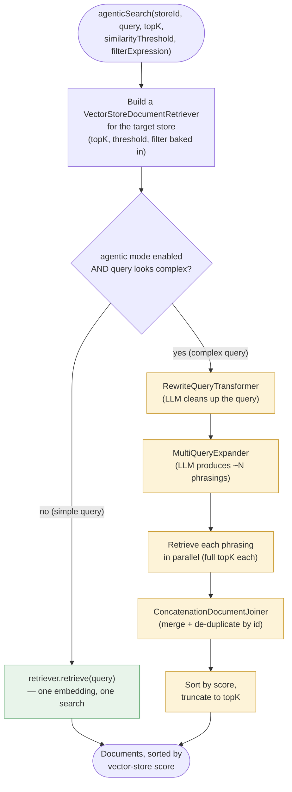
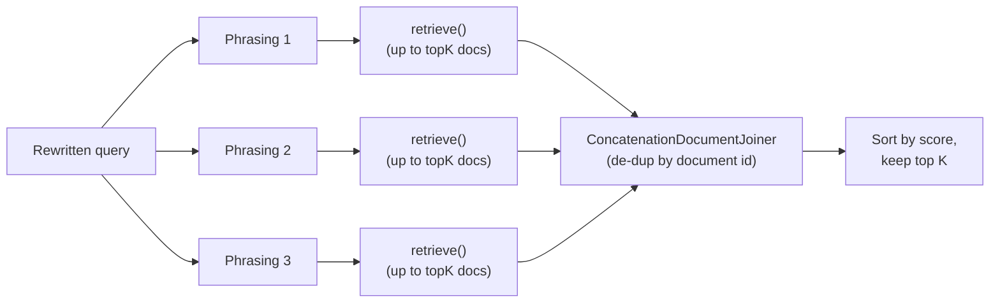

# The Agentic RAG Search Pipeline (`AgenticRagSearchService`)

This document explains, step by step, how `AgenticRagSearchService`
(`src/main/java/io/tonyblack10/aiplayground/rag/service/AgenticRagSearchService.java`) turns a
single natural-language query into a ranked list of documents. It is the retrieval engine behind
the `searchRagDocuments` MCP tool (`RagSearchMcpTools`), and is the concrete implementation of
the design described in `agentic-rag-proposta-melhoria.md`.

If you only remember one thing from this document, remember this: **the service has two modes —
a cheap, single-shot mode for simple queries, and a multi-step, LLM-assisted mode for complex
ones — and it picks between them automatically, per request.**

## 1. Why this class exists

A plain vector search does exactly one thing: it turns the caller's query into a single
embedding and asks the vector store for the nearest neighbors. That works well for short,
unambiguous queries ("Redis connection settings"), but it struggles with:

- **Compound questions** — "compare the Redis and pgvector setup and explain the differences in
  authentication" is really *several* questions bundled into one. A single embedding blurs them
  together and often misses chunks relevant to only one part of the question.
- **Vague or verbose phrasing** — a rambling question embeds "worse" than a clean, well-scoped
  one, simply because more of its words are irrelevant to what's actually being searched for.

`AgenticRagSearchService` addresses both problems by inserting two optional, LLM-assisted steps
*before* the vector search — query **rewriting** and query **expansion** — and by fanning a
single request out into several parallel searches whose results are then merged back into one
ranked list. This is the "Advanced RAG" / "RAG-Fusion" pattern, built entirely out of standard
`spring-ai-rag` building blocks (no bespoke retrieval logic).

## 2. The pipeline at a glance



Everything in yellow only runs for queries the service judges "complex." Everything in green is
the fallback path — functionally identical to a plain `VectorStore.similaritySearch()` call.
This means the common case (a short, specific query) pays **zero** extra latency or LLM cost;
the sophistication only kicks in when it's likely to pay off.

## 3. Step-by-step walkthrough

### 3.1. Build the retriever (always happens)

```java
VectorStoreDocumentRetriever.Builder retrieverBuilder = VectorStoreDocumentRetriever.builder()
    .vectorStore(store)
    .topK(topK)
    .similarityThreshold(similarityThreshold);
if (filterExpression != null) {
  retrieverBuilder.filterExpression(filterExpression);
}
DocumentRetriever retriever = retrieverBuilder.build();
```

Regardless of which path is taken below, the service first resolves the target `VectorStore`
(via `VectorStoreRegistry.getStore(storeId)`) and builds one `VectorStoreDocumentRetriever`
configured with the caller's `topK`, `similarityThreshold`, and optional metadata filter. This
retriever is reused for every search performed during this call — one call for a simple query,
several in parallel for a complex one.

### 3.2. Decide: simple or complex?

```java
private boolean isComplex(String query) {
  String trimmed = query.trim();
  int wordCount = trimmed.isEmpty() ? 0 : trimmed.split("\\s+").length;
  return wordCount > properties.getComplexityWordThreshold()
      || trimmed.matches("(?i).*\\b(and|or)\\b.*")
      || trimmed.contains(",");
}
```

This is a deliberately **cheap, non-LLM heuristic** — no network call, no extra latency. A query
is treated as complex if it's longer than a configurable word threshold (`app.rag.agentic
.complexity-word-threshold`, default 6), or if it contains `and`, `or`, or a comma — all weak
signals that the sentence bundles more than one idea. It doesn't need to be perfect: getting it
wrong for an occasional query just means a slightly-too-simple query gets the expensive
treatment, or a slightly-too-complex one doesn't — neither is a correctness bug, just a
cost/quality trade-off. The whole agentic path can also be turned off entirely via
`app.rag.agentic.enabled: false`, in which case every query takes the simple path.

### 3.3. The simple path

```java
if (!properties.isEnabled() || !isComplex(query)) {
  return Mono.fromCallable(() -> retriever.retrieve(new Query(query)))
      .subscribeOn(Schedulers.boundedElastic());
}
```

One call to `retriever.retrieve(...)`, which internally embeds the query and runs
`VectorStore.similaritySearch(...)` once. This is wrapped in `Mono.fromCallable(...)
.subscribeOn(Schedulers.boundedElastic())` because the underlying call is blocking I/O (an
HTTP call to the vector store, and potentially to the embedding model) — running it on the
bounded-elastic scheduler keeps it off Reactor's event-loop threads, consistent with how the
rest of the reactive codebase (`DocumentManagementService`) handles blocking work.

### 3.4. The complex path — step 1: rewrite

```java
private Query rewrite(String query) {
  QueryTransformer transformer = RewriteQueryTransformer.builder()
      .chatClientBuilder(chatClientBuilder)
      .targetSearchSystem("a vector store of ingested technical documentation and imported records")
      .build();
  return transformer.transform(new Query(query));
}
```

The raw query is handed to an LLM with instructions to rewrite it into a clearer, better-scoped
search query — dropping filler words, resolving vague phrasing, and generally producing
something that embeds more precisely. The `targetSearchSystem` hint tells the model what kind of
corpus it's optimizing for, which helps it avoid rewriting *toward* natural conversation and
*toward* something more like a search-engine query instead. The output is a new `Query` (Spring
AI's small record type — text plus optional context — from `spring-ai-rag`), not a raw string;
that's what step 2 expects.

### 3.5. The complex path — step 2: expand

```java
private List<Query> expand(Query query) {
  QueryExpander expander = MultiQueryExpander.builder()
      .chatClientBuilder(chatClientBuilder)
      .numberOfQueries(properties.getNumberOfQueries())
      .includeOriginal(true)
      .build();
  return expander.expand(query);
}
```

The rewritten query is then expanded by another LLM call into `numberOfQueries` (default 3)
*different phrasings* of the same underlying question — each emphasizing a different angle or
vocabulary. `includeOriginal(true)` means the rewritten query itself is always included among
the variants, so expansion can only add coverage, never lose the original intent. Rewriting
before expanding matters: each of the expanded phrasings inherits the clarity of the rewritten
query instead of amplifying the noise of the original one.

### 3.6. The complex path — step 3: fan-out retrieval

```java
.flatMap(subQueries -> Flux.fromIterable(subQueries)
    .flatMap(subQuery -> Mono.fromCallable(() -> Map.entry(subQuery, retriever.retrieve(subQuery)))
        .subscribeOn(Schedulers.boundedElastic()))
    .collectMap(Map.Entry::getKey, Map.Entry::getValue))
```



Every phrasing is searched **independently and in parallel** (`Flux.fromIterable(...)
.flatMap(...)`, each retrieval again offloaded to `boundedElastic`), and — importantly — each
search asks for the *full* `topK`, not `topK` split across phrasings. This is intentional: the
goal of expansion is to widen the net, so each phrasing gets to compete for the full result
budget on its own merits. Narrowing has to happen only at the very end, after everything has been
seen.

### 3.7. The complex path — step 4: fuse and truncate

```java
private List<Document> fuse(Map<Query, List<Document>> perQueryResults, int topK) {
  Map<Query, List<List<Document>>> forJoiner = perQueryResults.entrySet().stream()
      .collect(Collectors.toMap(Map.Entry::getKey, entry -> List.of(entry.getValue())));
  DocumentJoiner joiner = new ConcatenationDocumentJoiner();
  return joiner.join(forJoiner).stream()
      .sorted(Comparator.comparing(Document::getScore, Comparator.nullsLast(Comparator.reverseOrder())))
      .limit(topK)
      .toList();
}
```

The per-phrasing result lists are merged with Spring AI's `ConcatenationDocumentJoiner`, which
**de-duplicates by document id** — if the same chunk was retrieved by more than one phrasing
(common, and a good sign that chunk is genuinely relevant), it survives only once, keeping its
first-seen score. The merged, deduplicated list is then sorted by score (highest first) and cut
down to the caller's originally requested `topK`. From the caller's point of view, `topK` still
means exactly what it always meant — "at most this many results" — the widening only happened
internally, before this final cut.

## 4. Configuration

All tunable behavior lives in `AgenticRagProperties` (bound from `app.rag.agentic.*` in
`application.yaml`):

| Property | Default | Effect |
|---|---|---|
| `enabled` | `true` | Master switch. `false` forces every query through the simple, single-search path. |
| `number-of-queries` | `3` | How many phrasings `MultiQueryExpander` produces (the rewritten query is always included as one of them). |
| `complexity-word-threshold` | `6` | Queries with more words than this (or containing `and`/`or`/a comma) are treated as complex. |

## 5. Design notes and trade-offs

- **Why a heuristic instead of asking an LLM "is this complex?"** — that would itself be an LLM
  call on the hot path for *every* query, defeating the purpose of having a cheap fast path at
  all. The heuristic is intentionally coarse; the cost of misclassifying an occasional query is
  low compared to the cost of never having a cheap path.
- **Why retrieve `topK` per phrasing instead of `topK / N`?** — splitting the budget would mean
  each phrasing individually competes for a narrower slice, which tends to *reduce* recall
  exactly where expansion is supposed to increase it. Over-fetching and truncating once at the
  end gives every phrasing a fair, full-width shot.
  Also see `agentic-rag-proposta-melhoria.md`, Section 4.1, for how this choice maps back to the
  original "search misses relevant results" problem this pipeline was built to solve.
- **Why is everything wrapped in `Mono.fromCallable(...).subscribeOn(Schedulers.boundedElastic())`?**
  — `RewriteQueryTransformer.transform(...)`, `MultiQueryExpander.expand(...)`, and
  `DocumentRetriever.retrieve(...)` are all synchronous, blocking calls (HTTP requests to an LLM
  and/or a vector store). Running blocking calls on Reactor's event-loop threads would starve the
  reactive pipeline; `boundedElastic` is the scheduler meant for exactly this kind of bounded,
  blocking work, and it's the same pattern already used throughout `DocumentManagementService`.
- **Why is this orchestration hand-assembled instead of using Spring AI's
  `RetrievalAugmentationAdvisor`?** — that advisor composes the same building blocks used here
  (`QueryTransformer`, `QueryExpander`, `DocumentRetriever`, `DocumentJoiner`), but it only plugs
  into a `ChatClient` advisor chain (it operates on `ChatClientRequest`/`ChatClientResponse`).
  `searchRagDocuments` is a plain MCP tool method — it never goes through `ChatClient.prompt()`
  — so the individual components are composed directly instead. See
  `agentic-rag-proposta-melhoria.md`, Section 10.4, for the full reasoning.

## 6. Worked example

Query: `"how do I configure Redis as a vector store and what's different about authentication compared to pgvector?"`

1. **Complexity check**: 19 words, contains "and" → **complex**.
2. **Rewrite**: the LLM turns this into something closer to `"Redis vector store configuration and authentication differences versus pgvector"` — same intent, less conversational filler.
3. **Expand**: three phrasings are generated, e.g.
   - `"Redis vector store configuration and authentication differences versus pgvector"` (the rewritten query, included as-is)
   - `"how to set up Redis as a vector store backend"`
   - `"pgvector vs Redis authentication configuration"`
4. **Fan-out retrieval**: each phrasing is searched independently against the selected store, each returning up to `topK` documents — e.g. one phrasing surfaces Redis connection-config chunks, another surfaces pgvector auth chunks that the single-embedding version of this query might have ranked too low to make the cut.
5. **Fuse**: results are merged; any chunk found by more than one phrasing (a strong relevance signal) is kept once.
6. **Truncate**: the merged list is sorted by score and cut down to the caller's `topK`, returned as the tool's final answer.

## 7. Where this fits in the bigger picture

`AgenticRagSearchService` is called from `RagSearchMcpTools.searchRagDocuments`, after the
caller's `filterExpression` (if any) has already been parsed and validated against
`RagFilterSchema` by `FilterExpressionValidator` — this class only ever receives an
already-valid `Filter.Expression`, never a raw string. It has no knowledge of MCP, HTTP headers,
or tool-call plumbing; its only job is turning `(storeId, query, topK, threshold,
filterExpression)` into a ranked `List<Document>`. For the broader problem this pipeline solves
and how it compares with alternative approaches, see `agentic-rag-proposta-melhoria.md`.
