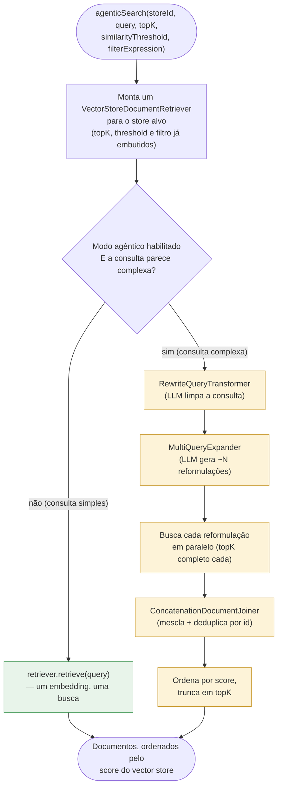
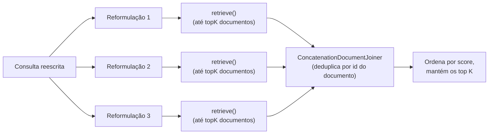

# O Pipeline de Busca RAG Agêntico (`AgenticRagSearchService`)

Este documento explica, passo a passo, como o `AgenticRagSearchService`
(`src/main/java/io/tonyblack10/aiplayground/rag/service/AgenticRagSearchService.java`) transforma
uma única consulta em linguagem natural em uma lista ranqueada de documentos. Ele é o motor de
recuperação por trás da ferramenta MCP `searchRagDocuments` (`RagSearchMcpTools`), e é a
implementação concreta do design descrito em `agentic-rag-proposta-melhoria.md`.

Se você só lembrar de uma coisa deste documento, que seja esta: **o serviço tem dois modos — um
modo barato, de um único passo, para consultas simples, e um modo em múltiplas etapas, assistido
por LLM, para consultas complexas — e ele escolhe entre os dois automaticamente, a cada
requisição.**

## 1. Por que essa classe existe

Uma busca vetorial simples faz exatamente uma coisa: transforma a consulta do chamador em um
único embedding e pede ao vector store os vizinhos mais próximos. Isso funciona bem para
consultas curtas e inequívocas ("configurações de conexão do Redis"), mas tem dificuldades com:

- **Perguntas compostas** — "compare a configuração do Redis com a do pgvector e explique as
  diferenças de autenticação" é, na verdade, *várias* perguntas embutidas em uma só. Um único
  embedding mistura tudo isso e frequentemente deixa passar trechos relevantes para apenas parte
  da pergunta.
- **Formulações vagas ou verbosas** — uma pergunta enrolada gera um embedding "pior" do que uma
  pergunta limpa e bem delimitada, simplesmente porque mais das suas palavras são irrelevantes
  para o que de fato está sendo buscado.

O `AgenticRagSearchService` resolve os dois problemas inserindo duas etapas opcionais, assistidas
por LLM, *antes* da busca vetorial — **reescrita** e **expansão** da consulta — e distribuindo
uma única requisição em várias buscas paralelas, cujos resultados são depois combinados de volta
em uma única lista ranqueada. Esse é o padrão "Advanced RAG" / "RAG-Fusion", construído
inteiramente a partir de blocos padrão do `spring-ai-rag` (sem lógica de recuperação sob medida).

## 2. Visão geral do pipeline



Tudo em amarelo só é executado para consultas que o serviço julga "complexas". Tudo em verde é o
caminho alternativo — funcionalmente idêntico a uma chamada simples de
`VectorStore.similaritySearch()`. Isso significa que o caso comum (uma consulta curta e
específica) não paga **nenhuma** latência ou custo de LLM extra; a sofisticação só entra em cena
quando há chance real de valer a pena.

## 3. Passo a passo

### 3.1. Monta o retriever (sempre acontece)

```java
VectorStoreDocumentRetriever.Builder retrieverBuilder = VectorStoreDocumentRetriever.builder()
    .vectorStore(store)
    .topK(topK)
    .similarityThreshold(similarityThreshold);
if (filterExpression != null) {
  retrieverBuilder.filterExpression(filterExpression);
}
DocumentRetriever retriever = retrieverBuilder.build();
```

Independentemente de qual caminho for seguido a seguir, o serviço primeiro resolve o
`VectorStore` alvo (via `VectorStoreRegistry.getStore(storeId)`) e monta um único
`VectorStoreDocumentRetriever` configurado com o `topK`, o `similarityThreshold` e o filtro de
metadados opcional do chamador. Esse retriever é reaproveitado em toda busca realizada durante
essa chamada — uma única busca para uma consulta simples, várias em paralelo para uma consulta
complexa.

### 3.2. Decisão: simples ou complexa?

```java
private boolean isComplex(String query) {
  String trimmed = query.trim();
  int wordCount = trimmed.isEmpty() ? 0 : trimmed.split("\\s+").length;
  return wordCount > properties.getComplexityWordThreshold()
      || trimmed.matches("(?i).*\\b(and|or)\\b.*")
      || trimmed.contains(",");
}
```

Essa é, deliberadamente, uma **heurística barata e sem LLM** — sem chamada de rede, sem latência
extra. Uma consulta é tratada como complexa se tiver mais palavras do que um limite configurável
(`app.rag.agentic.complexity-word-threshold`, padrão 6), ou se contiver "and", "or" ou uma
vírgula — todos sinais fracos de que a frase embute mais de uma ideia. Não precisa ser perfeita:
errar ocasionalmente só significa que uma consulta um pouco simples demais recebe o tratamento
caro, ou que uma um pouco complexa demais não recebe — nenhum dos dois casos é um bug de
corretude, apenas um trade-off de custo/qualidade. Todo o caminho agêntico também pode ser
desligado por completo via `app.rag.agentic.enabled: false`, caso em que toda consulta segue pelo
caminho simples.

### 3.3. O caminho simples

```java
if (!properties.isEnabled() || !isComplex(query)) {
  return Mono.fromCallable(() -> retriever.retrieve(new Query(query)))
      .subscribeOn(Schedulers.boundedElastic());
}
```

Uma única chamada a `retriever.retrieve(...)`, que internamente gera o embedding da consulta e
executa `VectorStore.similaritySearch(...)` uma vez. Isso é envolvido em
`Mono.fromCallable(...).subscribeOn(Schedulers.boundedElastic())` porque a chamada subjacente é
E/S bloqueante (uma chamada HTTP ao vector store e, potencialmente, ao modelo de embeddings) —
executá-la no scheduler bounded-elastic a mantém fora das threads do event-loop do Reactor,
consistente com a forma como o restante do código reativo (`DocumentManagementService`) trata
trabalho bloqueante.

### 3.4. O caminho complexo — passo 1: reescrita

```java
private Query rewrite(String query) {
  QueryTransformer transformer = RewriteQueryTransformer.builder()
      .chatClientBuilder(chatClientBuilder)
      .targetSearchSystem("a vector store of ingested technical documentation and imported records")
      .build();
  return transformer.transform(new Query(query));
}
```

A consulta bruta é entregue a um LLM com instruções para reescrevê-la em uma consulta de busca
mais clara e melhor delimitada — removendo palavras de preenchimento, resolvendo formulações
vagas e, de modo geral, produzindo algo que gere um embedding mais preciso. A dica
`targetSearchSystem` informa ao modelo para que tipo de corpus ele está otimizando, o que o ajuda
a não reescrever *em direção* a uma conversa natural, e sim *em direção* a algo mais parecido com
uma consulta de motor de busca. A saída é um novo `Query` (o pequeno tipo record do Spring AI —
texto mais contexto opcional — vindo do `spring-ai-rag`), não uma string bruta; é isso que o
passo 2 espera.

### 3.5. O caminho complexo — passo 2: expansão

```java
private List<Query> expand(Query query) {
  QueryExpander expander = MultiQueryExpander.builder()
      .chatClientBuilder(chatClientBuilder)
      .numberOfQueries(properties.getNumberOfQueries())
      .includeOriginal(true)
      .build();
  return expander.expand(query);
}
```

A consulta reescrita é então expandida por outra chamada de LLM em `numberOfQueries` (padrão 3)
*reformulações diferentes* da mesma pergunta subjacente — cada uma enfatizando um ângulo ou
vocabulário diferente. `includeOriginal(true)` significa que a própria consulta reescrita sempre
é incluída entre as variantes, então a expansão só pode adicionar cobertura, nunca perder a
intenção original. Reescrever antes de expandir importa: cada uma das reformulações geradas
herda a clareza da consulta reescrita, em vez de amplificar o ruído da consulta original.

### 3.6. O caminho complexo — passo 3: busca em leque (fan-out)

```java
.flatMap(subQueries -> Flux.fromIterable(subQueries)
    .flatMap(subQuery -> Mono.fromCallable(() -> Map.entry(subQuery, retriever.retrieve(subQuery)))
        .subscribeOn(Schedulers.boundedElastic()))
    .collectMap(Map.Entry::getKey, Map.Entry::getValue))
```



Cada reformulação é buscada **de forma independente e em paralelo** (`Flux.fromIterable(...)
.flatMap(...)`, cada busca novamente delegada ao `boundedElastic`), e — importante — cada busca
pede o `topK` *completo*, não `topK` dividido entre as reformulações. Isso é intencional: o
objetivo da expansão é ampliar a rede, então cada reformulação disputa o orçamento completo de
resultados por seus próprios méritos. O afunilamento só deve acontecer no final, depois que tudo
já foi considerado.

### 3.7. O caminho complexo — passo 4: fusão e corte

```java
private List<Document> fuse(Map<Query, List<Document>> perQueryResults, int topK) {
  Map<Query, List<List<Document>>> forJoiner = perQueryResults.entrySet().stream()
      .collect(Collectors.toMap(Map.Entry::getKey, entry -> List.of(entry.getValue())));
  DocumentJoiner joiner = new ConcatenationDocumentJoiner();
  return joiner.join(forJoiner).stream()
      .sorted(Comparator.comparing(Document::getScore, Comparator.nullsLast(Comparator.reverseOrder())))
      .limit(topK)
      .toList();
}
```

As listas de resultados de cada reformulação são combinadas com o `ConcatenationDocumentJoiner`
do Spring AI, que **deduplica por id de documento** — se o mesmo trecho foi recuperado por mais
de uma reformulação (algo comum, e um bom sinal de que aquele trecho é genuinamente relevante),
ele sobrevive apenas uma vez, mantendo o score da primeira ocorrência. A lista combinada e
deduplicada é então ordenada por score (do maior para o menor) e cortada até o `topK`
originalmente solicitado pelo chamador. Do ponto de vista de quem chamou, `topK` continua
significando exatamente o que sempre significou — "no máximo esta quantidade de resultados" — a
ampliação aconteceu apenas internamente, antes desse corte final.

## 4. Configuração

Todo o comportamento ajustável vive em `AgenticRagProperties` (vinculado a partir de
`app.rag.agentic.*` no `application.yaml`):

| Propriedade | Padrão | Efeito |
|---|---|---|
| `enabled` | `true` | Chave geral. `false` força toda consulta pelo caminho simples, de busca única. |
| `number-of-queries` | `3` | Quantas reformulações o `MultiQueryExpander` produz (a consulta reescrita sempre é incluída como uma delas). |
| `complexity-word-threshold` | `6` | Consultas com mais palavras do que este valor (ou contendo `and`/`or`/vírgula) são tratadas como complexas. |

## 5. Notas de design e trade-offs

- **Por que uma heurística em vez de perguntar a um LLM "isso é complexo?"** — isso, por si só,
  seria uma chamada de LLM no caminho quente para *toda* consulta, anulando o propósito de ter um
  caminho rápido e barato. A heurística é intencionalmente grosseira; o custo de classificar mal
  uma consulta ocasional é baixo comparado ao custo de nunca ter um caminho barato.
- **Por que buscar `topK` por reformulação em vez de `topK / N`?** — dividir o orçamento faria
  cada reformulação disputar individualmente uma fatia mais estreita, o que tende a *reduzir* o
  recall exatamente onde a expansão deveria aumentá-lo. Buscar mais do que o necessário e cortar
  apenas uma vez, no final, dá a cada reformulação uma chance justa e em largura total.
  Veja também `agentic-rag-proposta-melhoria.md`, Seção 4.1, para entender como essa escolha se
  conecta ao problema original de "a busca perde resultados relevantes" que este pipeline foi
  construído para resolver.
- **Por que tudo é envolvido em `Mono.fromCallable(...).subscribeOn(Schedulers.boundedElastic())`?**
  — `RewriteQueryTransformer.transform(...)`, `MultiQueryExpander.expand(...)` e
  `DocumentRetriever.retrieve(...)` são todas chamadas síncronas e bloqueantes (requisições HTTP a
  um LLM e/ou a um vector store). Executar chamadas bloqueantes nas threads do event-loop do
  Reactor esgotaria o pipeline reativo; o `boundedElastic` é o scheduler feito exatamente para
  esse tipo de trabalho bloqueante e limitado, e é o mesmo padrão já usado em todo o
  `DocumentManagementService`.
- **Por que essa orquestração é montada manualmente em vez de usar o `RetrievalAugmentationAdvisor`
  do Spring AI?** — esse advisor compõe os mesmos blocos usados aqui (`QueryTransformer`,
  `QueryExpander`, `DocumentRetriever`, `DocumentJoiner`), mas ele só se encaixa em uma cadeia de
  advisors do `ChatClient` (opera sobre `ChatClientRequest`/`ChatClientResponse`). O
  `searchRagDocuments` é um método de ferramenta MCP simples — nunca passa por
  `ChatClient.prompt()` — então os componentes individuais são compostos diretamente. Veja
  `agentic-rag-proposta-melhoria.md`, Seção 10.4, para o raciocínio completo.

## 6. Exemplo prático

Consulta: `"como eu configuro o Redis como vector store e qual a diferença de autenticação em relação ao pgvector?"`

1. **Verificação de complexidade**: 17 palavras, contém "e" (equivalente a "and") → **complexa**.
2. **Reescrita**: o LLM transforma isso em algo mais próximo de `"configuração do Redis como vector store e diferenças de autenticação em relação ao pgvector"` — mesma intenção, menos enrolação conversacional.
3. **Expansão**: três reformulações são geradas, por exemplo:
   - `"configuração do Redis como vector store e diferenças de autenticação em relação ao pgvector"` (a consulta reescrita, incluída como está)
   - `"como configurar o Redis como backend de vector store"`
   - `"configuração de autenticação: pgvector vs. Redis"`
4. **Busca em leque**: cada reformulação é buscada de forma independente contra o store selecionado, cada uma retornando até `topK` documentos — por exemplo, uma reformulação traz à tona trechos sobre configuração de conexão do Redis, outra traz trechos sobre autenticação no pgvector que a versão de embedding único desta consulta talvez tivesse ranqueado baixo demais para aparecer.
5. **Fusão**: os resultados são combinados; qualquer trecho encontrado por mais de uma reformulação (um forte sinal de relevância) é mantido uma única vez.
6. **Corte**: a lista combinada é ordenada por score e cortada até o `topK` do chamador, retornada como a resposta final da ferramenta.

## 7. Onde isso se encaixa no panorama geral

O `AgenticRagSearchService` é chamado a partir de `RagSearchMcpTools.searchRagDocuments`, depois
que o `filterExpression` do chamador (se houver) já foi analisado e validado contra o
`RagFilterSchema` pelo `FilterExpressionValidator` — essa classe só recebe uma `Filter.Expression`
já válida, nunca uma string bruta. Ela não tem conhecimento sobre MCP, headers HTTP ou a
mecânica de chamadas de ferramenta; seu único trabalho é transformar `(storeId, query, topK,
threshold, filterExpression)` em uma `List<Document>` ranqueada. Para o problema mais amplo que
este pipeline resolve e como ele se compara a abordagens alternativas, veja
`agentic-rag-proposta-melhoria.md`.
